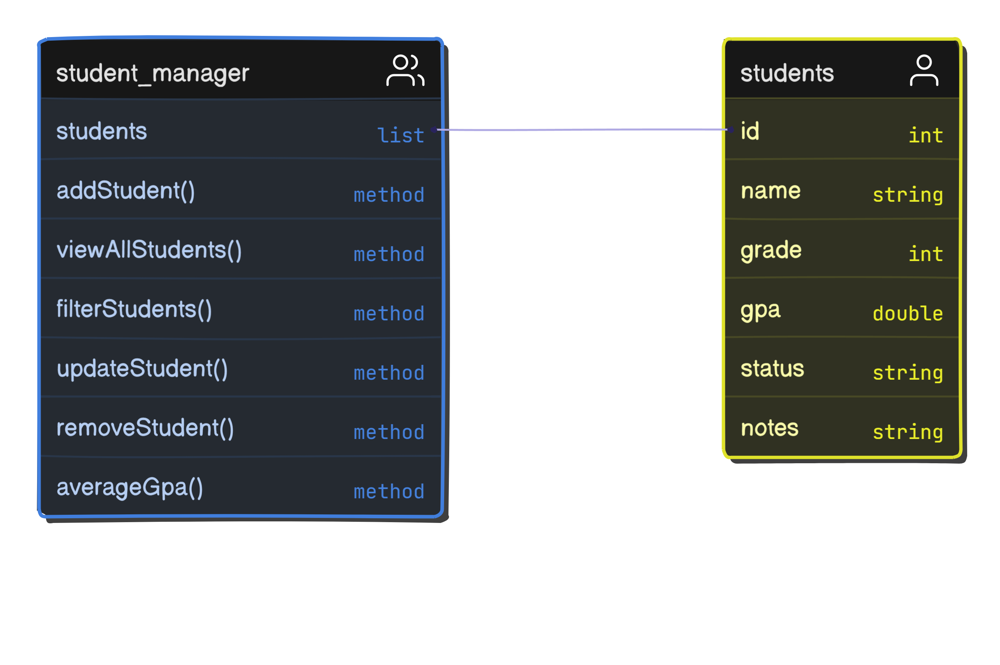
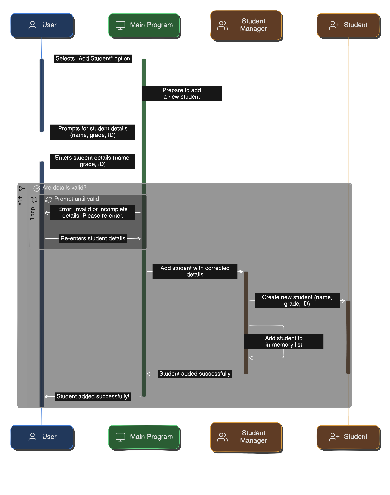

# StudentHub – Kotlin Console App

StudentHub is a simple Kotlin console application for managing student data.

## Features

- Add new students
- View all students
- Filter students by:
  - Name
  - Grade
  - Status
  - GPA range
- Update student information
- Remove students by ID
- Calculate average GPA of passed students

## Diagrams

### Class Diagram

### Sequence diagram for adding a new student

## Project Files

- `Student.kt`  
  Data class for student info (id, name, grade, gpa, status, notes)

- `StudentManager.kt`  
  Handles all student-related logic (add, view, filter, update, delete, calculate average GPA)

- `main.kt`  
  Main function and user menu

## Sample Menu

--- StudentHub Menu ---

Add student

View all students

Filter students

Update student info

Remove student

Show average GPA of passed students

Exit
Enter your choice:

## Requirements

- Kotlin 1.9 or higher
- IntelliJ IDEA or any Kotlin-supported IDE
- Basic terminal/console to interact with the program

## Notes

- Grade and GPA are optional (nullable)
- Status can be any text (e.g., Passed, Failed, Pending)
- Student IDs are auto-incremented starting from 1
